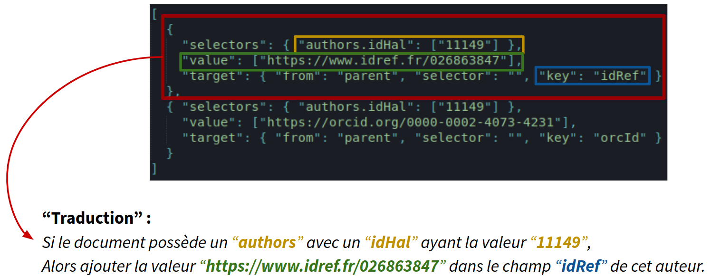

# co-enrichments
Module de gestion des enrichissements dans la chaîne de traitement conditor

## Installation ##

Installation du module via li-helpers

## Prérequis ##

Ajouter un/des fichier(s) d'enrchissement(s) puis créer (ou mettre à jour) le fichier conf.json

## Configuration ##

Créer un fichier conf.json (exemple : conf.default.json).
Le répertoire datasets/ permet de centraliser les différents fichiers.

```json
{
  "datasets": ["datasets/enrichments1.json", "datasets/enrichments2.json"]
}
```

## Enrichissements ##

### Structures ###

Un fichier d'enrichissements n'est rien d'autre qu'un tableau JSON regroupant un liste d'enrichissements.

```json
[
  {"selectors": {}, "value": "", "target": {}},
  {"selectors": {}, "value": 1, "target": {}},
  {"selectors": {}, "value": [], "target": {}},
  {"selectors": {}, "value": {}, "target": {}},
  ...
]
```

Chaque enrichissement est représenté par un objet JSON sous la forme : 

```json
{
  "selectors": {
    "my.selector": [
      "myValue"
    ]
  },
  "value": [
    "enrichmentValue"
  ],
  "target": {
    "from": "root",
    "selector": "",
    "key": "enrichments.myKey"
  }
}
```

### Exemple ###




### Propriétés d'un enrichissement ###

Explications pour chaque propriété d'un enrichissement :

    - [Object] selectors = Les clés représentent les différents sélecteurs, avec pour chacun la/les valeur(s) associée(s).
    - [Object|Array|String|Int|Boolean] value = La valeur de l'enrichissement.
    - [Object] target = L'endroit où l'enrichissement sera ajouté.
        - [String] from = Point de départ de la sélection (4 choix possibles) :
            - root = racine de l'objet
            - target = l'objet ciblé par le(s) sélecteur(s)
            - parent = le parent de l'objet ciblé par le(s) sélecteur(s)
            - item = chaque item ayant matché le(s) sélecteur(s) (utile lorsqu'un sélecteur "match" plusieurs items d'un tableau)
        - [String] selector =  Un sélector permettant d'affiner le ciblage (la donnée ciblée doit exister)
        - [String] key = La clé où sera stocké l'enrchissement (possibilité de créer des nouvelles propriétées)
    - [Boolean] erase : La nouvelle valeur remplacera l'ancienne en cas de conflit (donnée ciblée déjà existante). Par défaut à : false.

Rappel : Les propriétés de "selectors" et "target.selector" doivent obligatoirement contenir un sélecteur.

### Les sélecteurs ###

La structure de "selectors" est la suivante :

```js
/*
 * Exemple avec un seul sélecteur
 */
{
  "selectors": {
    "mySelector": [...]
  },
  ...
}
/*
 * Exemple avec plusieurs sélecteurs
 */
{
  "selectors": {
    "mySelector1": [...],
    "mySelector2": [...],
    "mySelector3": [...],
    ...
  },
  ...
}
```

Si un enrichissement à plusieurs "selectors", le module n'ajoutera l'enrichissement qu'aux objets respectant **tous** les critères.

Chaque sélecteur est sous la forme "property.subProperty.subSubProperty" (ou ""). Il permet au module de sélectionner n'importe quelle valeur **existante** d'un objet JSON.

Exemples de selecteur (pour un "docObject" Conditor) :

    - "" : renverra un objet JSON (le "docObjet" complet)
    - "authors": renverra un tableau d'objet JSON (où chaque item est un auteur)
    - "authors.halId" : renverra un tableau de string (où chaque item est l'idHal d'un auteur)
    - "authors.affiliations.address" : renverra un tableau de string (où chaque item est l'adresse de chaque affiliations de chaque auteur)

Toutes les valeurs associées aux "selectors" doivent être stockées dans un tableau JSON, comme suit :

```js
/*
 * Exemple avec une seule valeur
 */
{
  "mySelector": [ true ]
}
/*
 * Exemple avec plusieurs valeurs 
 */
{
  "mySelector": [
    "value1",
    "value2",
    "value3",
    "value4",
    ...
  ]
}
/*
 * Exemple avec plusieurs valeurs de n'importe quel type
 */
{
  "mySelector": [
    "value1",
    2,
    true,
    { "value": 1 },
    [ 1, 2, 3, 4, 5 ]
    [ {...}, 1, "2", true]
    ...
  ]
}
```

Pour chaque sélecteurs, le module va comparer les valeurs ciblées par les différents sélecteurs et aux valeurs attendues puis ajouter l'enrichissement à tout objet ayant **au moins** une des ces valeurs.

##### Exemples #####

Je veux ajouter un enrichissement aux objets ayant :

- comme "source" : "mySource" **ET** comme "publicationDate" : "myPublicationDate"

```js
/*
 * Je fais donc un seul enrichissement avec deux sélecteurs dans "selectors"
 */
[
  {
    "selectors": {
      "source": [
        "mySource"
      ],
      "publicationDate": [
        "myPublicationDate"
      ]
    },
    "value": [
      "myEnrichmentValue"
    ],
    "target": { ... }
  }
]

```

Je veux ajouter un enrichissement aux objets ayant :

- comme "source" : "mySource" **OU** comme "publicationDate" : "myPublicationDate"

```js
/*
 * Je fais donc deux enrichissements avec un seul sélecteur dans "selectors"
 */
[
  {
    "selectors": {
      "source": [
        "mySource"
      ]
    },
    "value": [
      "myEnrichmentValue"
    ],
    "target": { ... }
  },
  {
    "selectors": {
      "publicationDate": [
        "myPublicationDate"
      ]
    },
    "value": [
      "myEnrichmentValue"
    ],
    "target": { ... }
  }
]
```

Je veux ajouter un enrichissement aux documents ayant :

- Un auteur avec une affiliation avec l'adresse : "myAddress1" **OU** "myAddress2"


```js
/*
 * Je mets donc la valeur : "myAddress1" et "myAddress2"
 * dans le sélecteur : "authors.affiliations"
 */
[
  {
    "selectors": {
      "authors.affiliations.address": ["myAddress1", "myAddress2"]
    },
    "value": [
      "myEnrichmentValue"
    ],
    "target": { ... }
  }
]
```

Je veux ajouter un enrichissement aux documents ayant :

- Un auteur avec une affiliation avec l'adresse : "myAddress1" **ET** "myAddress2"

```js
/*
 * Je mets donc la valeur : [{"address": "myAddress1"}, {"address": "myAddress2"}]
 * dans le sélecteur : "authors.affiliations"
 */
[
  {
    "selectors": {
      "authors.affiliations": [[{"address": "myAddress1"}, {"address": "myAddress2"}]]
    },
    "value": [
      "myEnrichmentValue"
    ],
    "target": { ... }
  }
]
```
